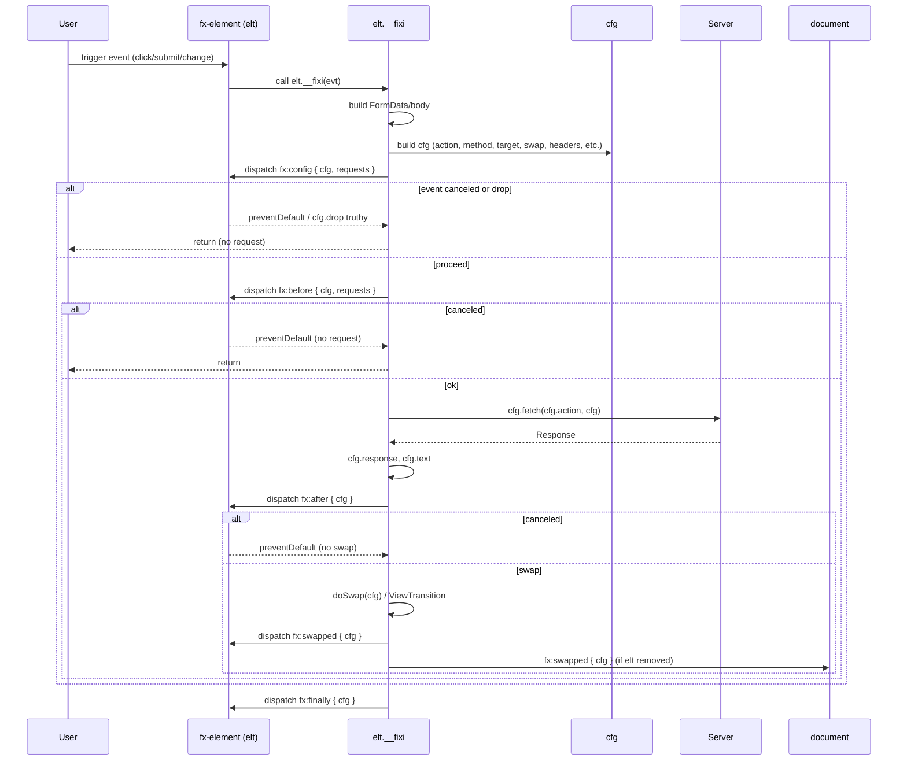

## fixi-redo Architecture

This document describes the internal structure and request lifecycle of `fixi-redo`'s core engine in `src/fixi.js`.

### High-Level Engine Structure

```mermaid
flowchart TD
  A[IIFE\n;(function () { ... })] --> B[Environment Guards\n- document defined?\n- document.__fixi_mo?]
  B --> C[Global Wiring\n- document.__fixi_mo = new MutationObserver\n- DOMContentLoaded listener\n- fx:process listener]
  C --> D[Helpers\n- send(elt, type, detail, bub)\n- attr(elt, name, defaultVal)\n- ignore(elt)]
  D --> E[Processing Pipeline: process(node)\n- skip if fx-ignore\n- init(node)\n- init(descendants [fx-action])]
  E --> F[Initialization: init(elt)\n- fx:init\n- build elt.__fixi\n- choose trigger event\n- addEventListener\n- fx:inited]
  F --> G[Per-Request Handler: elt.__fixi(evt)\n- build FormData/body\n- build cfg object\n- fx:config\n- drop logic\n- confirm()\n- fx:before\n- fetch(cfg.action, cfg)\n- fx:after / fx:error\n- fx:finally\n- swap\n- fx:swapped on elt & document]
  C --> E
```

### Request Lifecycle



### Key Platform APIs

The engine relies on the following web platform features:

- **MutationObserver** (DOM change observation): <https://developer.mozilla.org/en-US/docs/Web/API/MutationObserver>
- **CustomEvent** (fx:\* event dispatch): <https://developer.mozilla.org/en-US/docs/Web/API/CustomEvent>
- **Fetch API** (HTTP requests): <https://developer.mozilla.org/en-US/docs/Web/API/Fetch_API>
- **FormData** (form participation): <https://developer.mozilla.org/en-US/docs/Web/API/FormData>
- **URLSearchParams** (query parameter encoding): <https://developer.mozilla.org/en-US/docs/Web/API/URLSearchParams>
- **AbortController / AbortSignal** (cancellation): <https://developer.mozilla.org/en-US/docs/Web/API/AbortController>
- **View Transition API** (optional transitions around swaps): <https://developer.mozilla.org/en-US/docs/Web/API/View_Transition_API>

